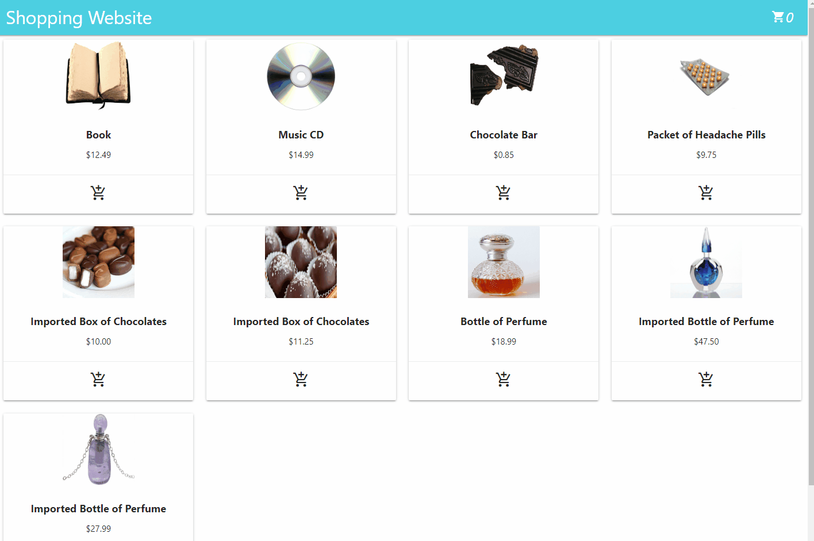

# _Fulcrum Shopping Website_

#### _This application is an enclosed simulated store front that calculates sales and import tax for items chosen, 5/22/2020_

#### By _**Alex Williams**_

## Description

_This web application is a simulated store front website. It takes the user's input in the form of chosen items that get added to a cart, that then calculates sales and import tax on applicable items. The 10% sales tax is applied on all good except books, food and medical products. The 5% import tax is an additional tax on all imported goods with no exceptions._

## Example Inputs

---

## Input 1:

1 book at 12.49,
1 music CD at 14.99,
1 chocolate bar at 0.85

### Output 1:

1 book at $12.49,
1 music CD at $16.49,
1 chocolate bar at \$0.85

#### Sales Tax: \$1.50

#### Total: \$29.83

---

## Input 2:

1 imported box of chocolates at $10.00,
1 imported bottle of perfume at $47.50

### Output 2:

1 imported box of chocolates at $10.50,
1 imported bottle of perfume at $54.65

#### Sales Tax: \$7.65

#### Total: \$65.15

---

## Input 3:

1 imported bottle of perfume at $27.99,
1 bottle of perfume at $18.99,
1 packet of headache pills at $9.75,
1 imported box of chocolates at $11.25

### Output 3:

1 imported bottle of perfume at $32.19,
1 bottle of perfume at $20.89,
1 packet of headache pills at $9.75,
1 imported box of chocolates at $11.85

#### Sales Tax: \$6.70

#### Total: \$74.68

---

## Setup/Installation Requirements

- _Clone or Download the repo._
- _Open folder in VSCode or other suitable IDE._
- _In the terminal, run "npm i" to install the required npm packages._
- _In the terminal, run "npm run start" to start the client._
- _If not already open, navigate to localhost:3000 in your favorite browser to view._

_No Server or Database information required to run. It is all client side._

## Known Bugs

_No known bugs or errors._

## Support and contact details

_Email: Zizzs17@gmail.com_

## Technologies Used

_Javascript, React, Materialize CSS, UUID_

### License

_MIT License_

Copyright (c) 2020 **_Alex Williams_**
